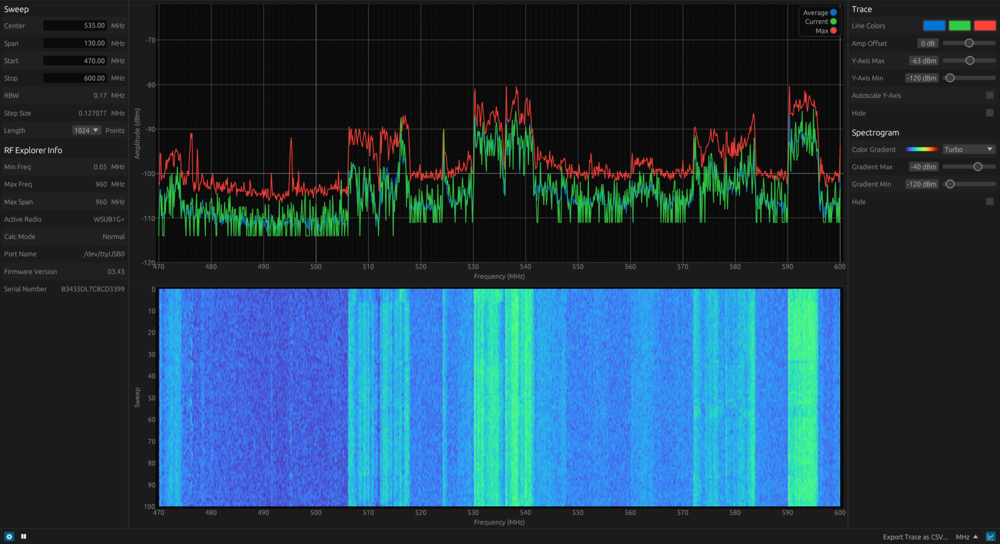
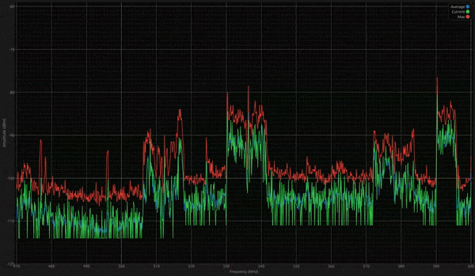
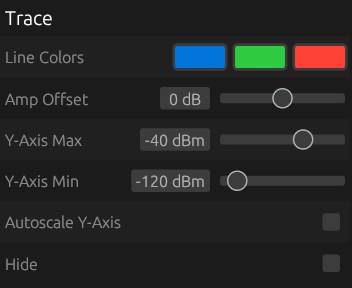
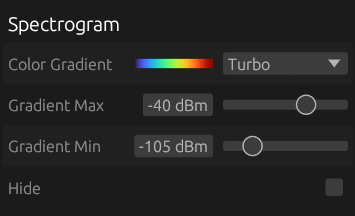
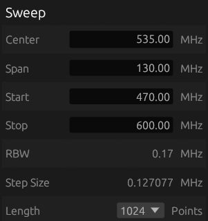

# rfe-gui

`rfe-gui` is a graphical user interface for visualizing data from [RF Explorer](https://www.j3.rf-explorer.com/) spectrum analyzers

## Features

### Trace View

`rfe-gui` displays the current, average, and max trace using sweeps measured by an RF Explorer. The visibility of each trace can be toggled by clicking on its name in the legend in the upper right corner.

The line colors and axis bounds of the trace can be changed using the controls in the right side panel.

### Spectrogram View

`rfe-gui` displays a spectrogram to provide a visual representation of the last 100 sweeps measured by an RF Explorer.

The spectrogram's color gradient and intensity can be changed using the controls in the right side panel.

### Sweep Settings

The sweep's frequency bounds and, on RF Explorer PLUS models, resolution can be changed using the controls in the left side panel.

### Export Trace

`rfe-gui` can export the current, average, or max trace as a CSV file by clicking on the "Export Trace as CSV" button in the bottom right corner.
